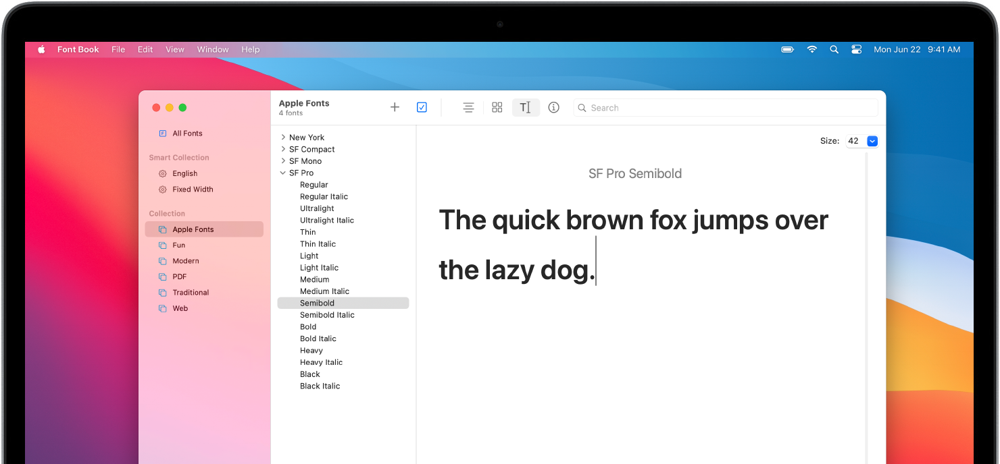

# Apple system fonts
This repository provides fonts for the Apple system. The fonts are extracted fron the .dmg files, which can be obtained at https://developer.apple.com/fonts/.

The available fonts are:
* SF Pro
* SF Compact
* SF Mono
* New York



## Prerequisites
These packages must be installed:
* `dmg2img`
* `p7zip-full`

## Extract fonts
* Extract all fonts:
    ```shell
    make
    ```
* Extract and pack all fonts into `fonts.zip`:
    ```shell
    make zip
    ```

## Clean up
* Clean up generated fonts:
    ```shell
    make clean
    ```
* Clean up the generated `fonts.zip` file:
    ```shell
    make rmzip
    ```